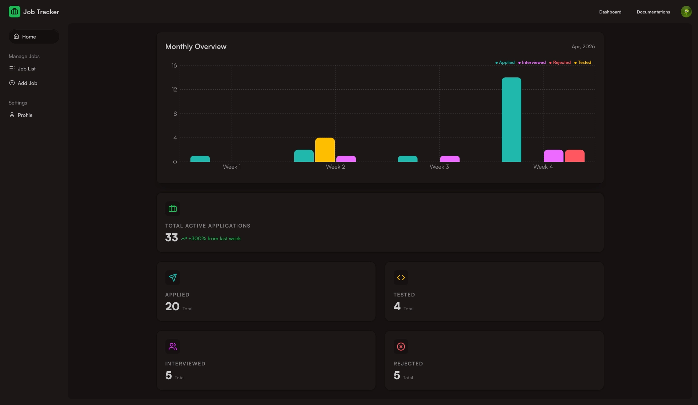
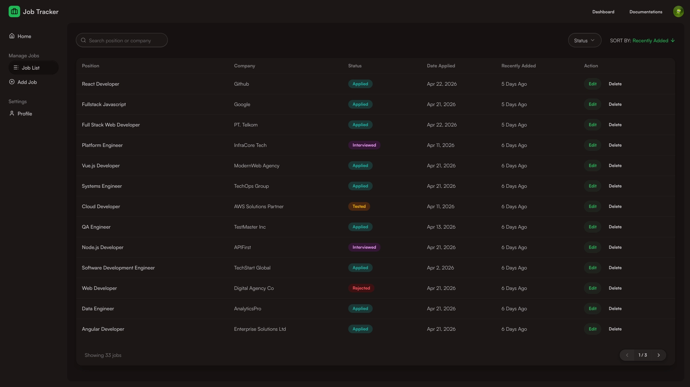
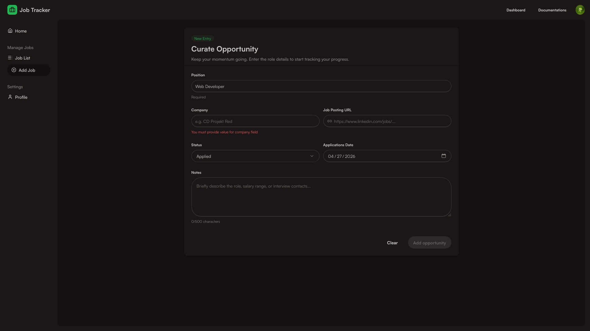

# Job Tracker App

Job Tracker App is a full-stack web application for job seekers to manage and track their job application process in one place. It provides a structured workflow for recording applications, updating progress, and reviewing outcomes through a dashboard interface.


_Dashboard page showing monthly stats and job status summary_


_Dashboard page showing user job list_


_Dashboard page showing add job form_

## Project Overview

Searching for jobs often involves many moving parts: multiple companies, different statuses, interview stages, and follow-up actions.  
This project is designed to reduce that complexity by giving users a dedicated system to track their journey from application to final decision.

### What the app helps users do

- Store job applications in a centralized list
- Update each application status over time
- Search, filter, sort, and paginate job data
- View dashboard statistics and trends
- Manage profile and account data securely

### Architecture summary

- **Backend** handles authentication, business logic, and data persistence.
- **Frontend** provides an SSR-based user interface and state management.
- **SQLite** keeps deployment lightweight and simple.
- **Docker** enables reproducible local and server environments.

## Features

- Email/password authentication
- Google OAuth integration (optional)
- Create, read, update, and delete job entries
- Job status tracking and management
- Dashboard summary cards and monthly chart data
- Profile update and account deletion support
- Route protection for authenticated areas

## Tech Stack

### Backend

| Technology            | Purpose                                      |
| --------------------- | -------------------------------------------- |
| Bun                   | JavaScript runtime and package manager       |
| Hono                  | HTTP server framework and routing            |
| SQLite (`bun:sqlite`) | Lightweight embedded database                |
| Better Auth           | Authentication and session management        |
| Pino                  | Structured logging                           |
| Zod                   | Schema validation for request/data integrity |

### Frontend

| Technology          | Purpose                                         |
| ------------------- | ----------------------------------------------- |
| React Router (SSR)  | Routing and server-side rendering               |
| Vite                | Build tool and dev server                       |
| Tailwind CSS        | Utility-first styling                           |
| DaisyUI             | Prebuilt UI components for Tailwind             |
| Redux Toolkit       | Global state management                         |
| TanStack Query      | Server-state fetching and caching               |
| Tanstack Form + Zod | Form state, validation, and submission handling |
| Axios               | HTTP client for API requests                    |

## Repository Structure

```text
├── backend/              # API server, auth, database, etc..
├── frontend/             # React Router SSR app, components, etc..
├── docs/                 # Additional project notes
├── .env.example
├── .gitignore
├── docker-compose.yml
└── README.md
```

## Environment Variables

### Example files

- `backend/.env.example`
- `frontend/.env.example`
- `.env.example` (root)

Use these as references and create actual `.env` files for your environment.

## Local Setup

### 1. Clone repo

```bash
git clone https://github.com/21Chillie/job-tracker-app.git

cd job-tracker-app
```

### 2. Install dependencies

```bash
cd backend
bun install

cd ../frontend
bun install
```

### 3. Configure environment

- Configure backend environment variables.
- Configure frontend `VITE_BACKEND_URL` to point to backend URL

### 4. Run backend

```bash
cd backend
bun run start # or `bun run dev`
```

Backend default: `http://localhost:3001`

### 5. Run frontend

```bash
cd frontend
bun run build && bun run start # or `bun run dev`
```

Frontend default: `http://localhost:3000`

## Docker Setup

### Build images manually

```bash
docker build -f backend/Dockerfile -t job-tracker-backend:local ./backend

docker build -f frontend/Dockerfile \
  -t job-tracker-frontend:local \
  --build-arg VITE_BACKEND_URL=http://localhost:3001 \
  ./frontend
```

### Run with Docker Compose

```bash
docker compose up --build
```

Current compose mapping:

- Frontend: `http://localhost:3001`
- Backend: `http://localhost:3001`

Stop services:

```bash
docker compose down
```

## License

MIT License. See [LICENSE](./LICENSE).

> This project was built for learning and portfolio purposes. Feel free to use the code in any way you like.

# Job Tracker App

Job Tracker App is a full-stack web application for job seekers to manage and track their job application process in one place. It provides a structured workflow for recording applications, updating progress, and reviewing outcomes through a dashboard interface.

## Project Overview

Searching for jobs often involves many moving parts: multiple companies, different statuses, interview stages, and follow-up actions.  
This project is designed to reduce that complexity by giving users a dedicated system to track their journey from application to final decision.

### What the app helps users do

- Store job applications in a centralized list
- Update each application status over time
- Search, filter, sort, and paginate job data
- View dashboard statistics and trends
- Manage profile and account data securely

### Architecture summary

- **Backend** handles authentication, business logic, and data persistence.
- **Frontend** provides an SSR-based user interface and state management.
- **SQLite** keeps deployment lightweight and simple.
- **Docker** enables reproducible local and server environments.

## Features

- Email/password authentication
- Google OAuth integration (optional)
- Create, read, update, and delete job entries
- Job status tracking and management
- Dashboard summary cards and monthly chart data
- Profile update and account deletion support
- Route protection for authenticated areas

## Tech Stack

### Backend

| Technology            | Purpose                                      |
| --------------------- | -------------------------------------------- |
| Bun                   | JavaScript runtime and package manager       |
| Hono                  | HTTP server framework and routing            |
| SQLite (`bun:sqlite`) | Lightweight embedded database                |
| Better Auth           | Authentication and session management        |
| Pino                  | Structured logging                           |
| Zod                   | Schema validation for request/data integrity |

### Frontend

| Technology          | Purpose                                         |
| ------------------- | ----------------------------------------------- |
| React Router (SSR)  | Routing and server-side rendering               |
| Vite                | Build tool and dev server                       |
| Tailwind CSS        | Utility-first styling                           |
| DaisyUI             | Prebuilt UI components for Tailwind             |
| Redux Toolkit       | Global state management                         |
| TanStack Query      | Server-state fetching and caching               |
| Tanstack Form + Zod | Form state, validation, and submission handling |
| Axios               | HTTP client for API requests                    |

## Repository Structure

```text
├── backend/              # API server, auth, database, etc..
├── frontend/             # React Router SSR app, components, etc..
├── docs/                 # Additional project notes
├── .env.example
├── .gitignore
├── docker-compose.yml
└── README.md
```

## Environment Variables

### Example files

- `backend/.env.example`
- `frontend/.env.example`
- `.env.example` (root)

Use these as references and create actual `.env` files for your environment.

## Local Setup

### 1. Clone repo

```bash
git clone https://github.com/21Chillie/job-tracker-app.git

cd job-tracker-app
```

### 2. Install dependencies

```bash
cd backend
bun install

cd ../frontend
bun install
```

### 3. Configure environment

- Configure backend environment variables.
- Configure frontend `VITE_BACKEND_URL` to point to backend URL

### 4. Run backend

```bash
cd backend
bun run start # or `bun run dev`
```

Backend default: `http://localhost:3001`

### 5. Run frontend

```bash
cd frontend
bun run build && bun run start # or `bun run dev`
```

Frontend default: `http://localhost:3000`

## Docker Setup

### Build images manually

```bash
docker build -f backend/Dockerfile -t job-tracker-backend:local ./backend

docker build -f frontend/Dockerfile \
  -t job-tracker-frontend:local \
  --build-arg VITE_BACKEND_URL=http://localhost:3001 \
  ./frontend
```

### Run with Docker Compose

```bash
docker compose up --build
```

Current compose mapping:

- Frontend: `http://localhost:3001`
- Backend: `http://localhost:3001`

Stop services:

```bash
docker compose down
```

## License

MIT License. See [LICENSE](./LICENSE).

> _This project was built for learning and portfolio purposes. Feel free to use the code in any way you like._
